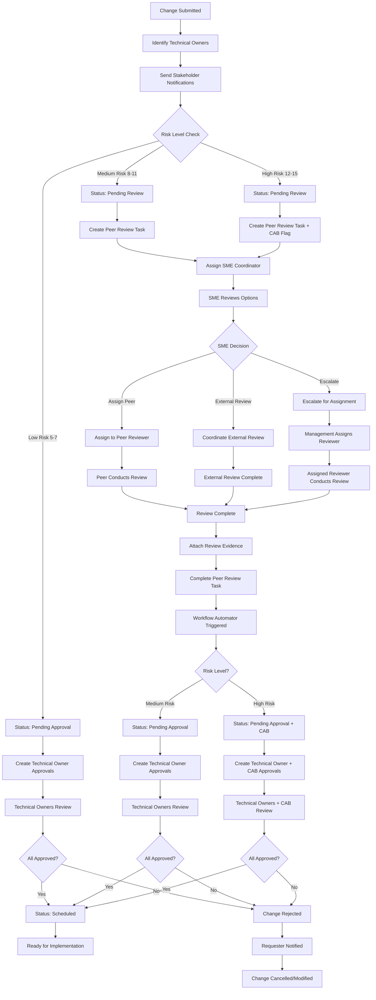

# Change Management Application - User Guide

## Table of Contents
1. [Overview](#overview)
2. [Getting Started](#getting-started)
3. [Step-by-Step Process](#step-by-step-process)
4. [Roles and Responsibilities](#roles-and-responsibilities)
5. [Policies and Procedures](#policies-and-procedures)
6. [Process Flow Diagrams](#process-flow-diagrams)
7. [Best Practices](#best-practices)
8. [Troubleshooting](#troubleshooting)

## Overview

The Change Management Application is a comprehensive tool for submitting, reviewing, and managing IT change requests. It automates stakeholder identification, risk assessment, approval workflows, and notification processes to ensure proper change governance.

### Key Features
- **Automated Risk Assessment**: 5-factor scoring system for change risk evaluation
- **Stakeholder Identification**: Automatic identification of technical owners and impacted parties
- **Approval Workflows**: Risk-based approval processes with peer review coordination
- **Asset Impact Analysis**: Comprehensive asset association and impact assessment
- **Notification Management**: Automated stakeholder notifications and status updates

## Getting Started

### Prerequisites
- Access to Freshservice instance
- Assigned role: Requester, Agent, or Admin
- Understanding of systems and assets being changed
- Knowledge of change implementation plans

### Initial Setup
1. **Log into Freshservice**
2. **Navigate to Change Management App**
3. **Verify your user profile and permissions**
4. **Review available assets and services**

## Step-by-Step Process

### Phase 1: Change Request Preparation

#### Step 1: Change Details
**Purpose**: Define the basic change information

**Required Information**:
- **Change Title**: Clear, descriptive title (e.g., "Database Schema Update for Customer Portal")
- **Change Description**: Detailed explanation of what will be changed
- **Reason for Change**: Business justification and drivers
- **Change Type**: Normal or Emergency
- **Requester**: Person requesting the change
- **Assigned Agent**: IT agent responsible for coordination

**Best Practices**:
- Use clear, non-technical language for business stakeholders
- Include specific system names and versions
- Reference related tickets or incidents if applicable

#### Step 2: Asset Association
**Purpose**: Identify all systems and assets impacted by the change

**Process**:
1. **Search for Assets**: Use the asset search functionality
2. **Select Impacted Assets**: Choose all systems that will be directly affected
3. **Review Asset Details**: Verify technical owners and dependencies
4. **Add Related Assets**: Include any dependent systems

**Asset Information Captured**:
- Asset name and type
- Technical owner/manager
- Location and department
- Current status and configuration

**Impact Analysis**:
- **Direct Assets**: Systems being directly modified
- **Related Assets**: Systems with dependencies
- **Technical Owners**: Automatically identified from asset management
- **Stakeholders**: Users and managers of impacted systems

#### Step 3: Risk Assessment
**Purpose**: Evaluate the risk level of the proposed change

**Risk Factors** (1-3 scale each):
1. **Business Impact**: Effect on business operations
   - 1: Minimal impact, isolated system
   - 2: Moderate impact, affects department
   - 3: High impact, affects multiple departments/customers

2. **Affected Users**: Number of users impacted
   - 1: <10 users
   - 2: 10-100 users
   - 3: >100 users

3. **Complexity**: Technical complexity of the change
   - 1: Simple, routine change
   - 2: Moderate complexity, standard procedure
   - 3: Complex, involves multiple systems/teams

4. **Testing Level**: Extent of testing performed
   - 1: Comprehensive testing in production-like environment
   - 2: Limited testing, some risk present
   - 3: Minimal testing, high uncertainty

5. **Rollback Risk**: Difficulty of undoing the change
   - 1: Easy rollback, automated process
   - 2: Moderate rollback complexity
   - 3: Difficult rollback, potential data loss

**Risk Levels**:
- **Low Risk**: Total Score 5-7 (Standard approval process)
- **Medium Risk**: Total Score 8-11 (Peer review required)
- **High Risk**: Total Score 12-15 (Enhanced oversight required)

#### Step 4: Implementation Planning
**Purpose**: Document how the change will be executed

**Required Plans**:
1. **Implementation Plan**: Step-by-step execution procedure
2. **Validation Plan**: How success will be verified
3. **Backout Plan**: Rollback procedure if issues occur

**Implementation Plan Elements**:
- Pre-change preparations
- Detailed implementation steps
- Expected duration for each step
- Dependencies and prerequisites
- Resource requirements

**Validation Plan Elements**:
- Success criteria and metrics
- Testing procedures
- Verification checkpoints
- Acceptance criteria

**Backout Plan Elements**:
- Trigger conditions for rollback
- Step-by-step rollback procedure
- Data recovery processes
- Communication plan for rollback

#### Step 5: Scheduling
**Purpose**: Define when the change will occur

**Scheduling Requirements**:
- **Planned Start**: When implementation begins
- **Planned End**: When implementation completes
- **Lead Time**: Minimum 2 days advance notice (configurable)
- **Duration**: Should be realistic and include buffer time

**Scheduling Considerations**:
- Business hours vs. maintenance windows
- Dependency on other changes
- Resource availability
- Business calendar and blackout dates

### Phase 2: Review and Validation

#### Step 6: Impact Review
**Purpose**: Review the comprehensive impact analysis

**Impact Summary Includes**:
- Asset count and types
- Technical owner identification
- Stakeholder mapping
- Risk assessment results
- Implementation readiness score

**Review Actions**:
- Verify all impacted assets are included
- Confirm technical owners are correct
- Review stakeholder list for completeness
- Validate risk assessment scores

#### Step 7: Submission Validation
**Purpose**: Final validation before submission

**Validation Checklist**:
- [ ] All required fields completed
- [ ] Risk assessment completed
- [ ] Implementation plan documented
- [ ] Validation plan documented
- [ ] Backout plan documented
- [ ] Schedule defined with adequate lead time
- [ ] Assets associated and verified
- [ ] Impact analysis reviewed

### Phase 3: Submission and Workflow

#### Step 8: Change Request Submission
**Purpose**: Submit the change request to Freshservice

**Submission Process**:
1. **Final Review**: Last chance to review all information
2. **Submit Request**: Create change request in Freshservice
3. **Asset Association**: Link selected assets to change
4. **Stakeholder Notifications**: Send notifications to identified stakeholders
5. **Risk-Based Routing**: Route to appropriate approval state based on risk level
6. **Workflow Automation**: Initiate automated approval processes

**Initial Status Assignment**:
- **Low Risk Changes (Score 5-7)**: Status = "Pending Approval"
- **Medium/High Risk Changes (Score 8-15)**: Status = "Pending Review"

**Automated Actions**:
- Change request creation with comprehensive description
- Asset association and impact documentation
- Stakeholder notification via change notes
- Approval ticket creation for technical owners
- Peer review coordination task assignment (if required)
- Additional approver field population

## Roles and Responsibilities

### Change Requester
**Primary Role**: Initiates and owns the change request

**Responsibilities**:
- Define clear change requirements and business justification
- Complete comprehensive change documentation
- Identify all impacted assets and systems
- Coordinate with technical teams for implementation details
- Respond to questions during approval process
- Execute the change according to documented plan
- Provide post-implementation validation

**Required Skills**:
- Understanding of business requirements
- Knowledge of impacted systems
- Basic project management skills
- Communication and documentation skills

### Assigned Agent
**Primary Role**: Technical coordinator and subject matter expert

**Responsibilities**:
- Review technical feasibility of proposed change
- Validate implementation and backout plans
- Coordinate peer review process (for medium/high risk changes)
- Provide technical expertise and guidance
- Monitor change implementation
- Ensure proper documentation and closure

**Required Skills**:
- Technical expertise in relevant systems
- Change management process knowledge
- Risk assessment capabilities
- Communication and coordination skills

### Technical Owners
**Primary Role**: Asset owners and approvers

**Responsibilities**:
- Review impact on owned assets and systems
- Approve or reject change requests affecting their systems
- Provide technical input on implementation approach
- Participate in risk assessment validation
- Monitor systems during implementation
- Provide expertise for troubleshooting

**Authority**:
- Approve/reject changes affecting owned assets
- Require additional testing or documentation
- Recommend alternative approaches
- Escalate high-risk changes

### Stakeholders
**Primary Role**: Impacted parties and information recipients

**Responsibilities**:
- Review change notifications and impact assessment
- Provide feedback on potential business impact
- Communicate with end users about planned changes
- Participate in testing if required
- Report issues or concerns

**Communication Requirements**:
- Receive automated notifications for relevant changes
- No approval authority unless also technical owner
- Expected to provide feedback within reasonable timeframe

### Peer Reviewers
**Primary Role**: Independent technical validation

**Responsibilities**:
- Conduct independent review of medium/high risk changes
- Validate technical approach and risk assessment
- Identify potential issues or alternative approaches
- Provide recommendations for improvement
- Document review findings and recommendations

**Required Qualifications**:
- Technical expertise in relevant domain
- Independence from change planning and implementation
- Change management and risk assessment experience
- Ability to provide constructive feedback

### Change Advisory Board (CAB)
**Primary Role**: Governance and oversight

**Responsibilities**:
- Review high-risk and complex changes
- Provide strategic guidance on change priorities
- Approve exceptions to standard processes
- Monitor change success rates and metrics
- Continuously improve change management processes

**Authority**:
- Override individual approvals for strategic reasons
- Mandate additional review or testing
- Postpone or cancel changes for business reasons
- Establish change management policies and procedures

## Policies and Procedures

### Change Classification Policy

#### Risk-Based Classification
**Low Risk Changes (Score 5-7)**:
- **Initial Status**: "Pending Approval"
- **Approval Requirements**: Technical owner approval only
- **Lead Time**: Minimum 2 business days
- **Documentation**: Standard implementation plan required
- **Review Process**: Direct to technical owner approval
- **Examples**: Routine updates, minor configuration changes

**Medium Risk Changes (Score 8-11)**:
- **Initial Status**: "Pending Review"
- **Approval Requirements**: Peer review → Technical owner approval
- **Lead Time**: Minimum 5 business days
- **Documentation**: Implementation, validation, and backout plans required
- **Review Process**: Peer review coordination → Workflow automator → Technical owner approval
- **Examples**: System upgrades, database changes, network modifications

**High Risk Changes (Score 12-15)**:
- **Initial Status**: "Pending Review"
- **Approval Requirements**: Peer review → Technical owner + CAB approval
- **Lead Time**: Minimum 10 business days
- **Documentation**: Comprehensive planning including detailed risk mitigation
- **Review Process**: Peer review coordination → Workflow automator → Technical owner + CAB approval
- **Examples**: Major system replacements, architecture changes, data migrations

#### Status Definitions
**Pending Review**: Change requires peer review before approval process can begin
**Pending Approval**: Change is awaiting approval from technical owners and/or CAB
**Scheduled**: All approvals obtained, change ready for implementation during maintenance window

#### Emergency Changes
**Criteria for Emergency Classification**:
- Critical system outage or security vulnerability
- Immediate business impact requiring urgent resolution
- Failure of previous change requiring immediate rollback

**Emergency Change Process**:
- **Approval**: Can be implemented with post-approval
- **Documentation**: Abbreviated documentation acceptable initially
- **Review**: Mandatory post-implementation review within 48 hours
- **CAB Review**: All emergency changes reviewed at next CAB meeting

### Approval Workflow Procedures

#### Risk-Based Status Assignment
Upon submission, changes are assigned an initial status based on risk level:

**Low Risk Changes (Score 5-7)**:
- **Initial Status**: "Pending Approval"
- **Immediate Action**: Technical owner approval tickets created
- **Process**: Standard approval workflow begins immediately

**Medium/High Risk Changes (Score 8-15)**:
- **Initial Status**: "Pending Review"  
- **Immediate Action**: Peer review coordination task created
- **Process**: Must complete peer review before moving to approval phase

#### Standard Approval Process (Low Risk)
1. **Automatic Stakeholder Identification**: System identifies technical owners and stakeholders
2. **Status Assignment**: Change status set to "Pending Approval"
3. **Approval Ticket Creation**: Individual approval tickets created for each technical owner
4. **Stakeholder Notification**: Notification sent to all impacted stakeholders
5. **Parallel Approvals**: All approvals processed simultaneously
6. **Status Update**: When all approvals received, status changes to "Scheduled"

#### Peer Review Coordination Process (Medium/High Risk)
**Triggered For**: Medium and High risk changes (score ≥ 8)

**Phase 1: Peer Review (Status: "Pending Review")**:
1. **SME Assignment**: Agent SME identified (assigned agent → technical owner → asset manager)
2. **Coordination Task**: Task created for SME to coordinate peer review
3. **SME Options**:
   - Assign to qualified peer reviewer (different from requester and SME)
   - Coordinate external review and attach evidence
   - Escalate for appropriate reviewer assignment
4. **Review Completion**: SME provides evidence of completed review
5. **Documentation**: Review findings attached to change request

**Phase 2: Workflow Automation Trigger**:
1. **Task Completion Detection**: Freshservice workflow automator monitors peer review task
2. **Status Transition**: Upon task completion, status changes to "Pending Approval"
3. **Approval Release**: Workflow automator creates approval tickets for technical owners
4. **CAB Escalation**: For high risk changes, additional CAB approvals are created

**Phase 3: Approval Process (Status: "Pending Approval")**:
1. **Technical Owner Approvals**: Standard approval process begins
2. **CAB Review**: High risk changes include Change Advisory Board approval
3. **Parallel Processing**: All approvals processed simultaneously
4. **Final Status**: When all approvals received, status changes to "Scheduled"

#### Escalation Procedures
**Escalation Triggers**:
- Approval not received within defined timeframes
- Conflicting approvals or recommendations
- Technical disagreement on implementation approach
- Risk assessment disputes

**Escalation Process**:
1. **Automatic Escalation**: System escalates overdue approvals
2. **Management Review**: Department managers review escalated items
3. **CAB Escalation**: Complex disputes escalated to CAB
4. **Executive Decision**: Final authority rests with IT leadership

### Notification and Communication Policy

#### Stakeholder Notification Requirements
**Automatic Notifications Sent To**:
- Technical owners of impacted assets
- Identified stakeholders from impacted services analysis
- Assigned agent and change requester
- Department managers for high-impact changes

**Notification Content**:
- Change overview and business justification
- Impacted assets and services
- Planned timing and duration
- Contact information for questions
- Clear statement that no approval action required (for stakeholders)

**Notification Timing**:
- Immediate notification upon change submission
- Reminder notifications for pending approvals
- Status updates for significant change events
- Completion notification with results

#### Communication Standards
**Required Information in Notifications**:
- Change request ID and title
- Risk level and impact assessment
- Implementation schedule
- Contact information for questions
- Clear action requirements (if any)

**Communication Channels**:
- Primary: Automated email notifications
- Secondary: Freshservice notifications
- Escalation: Direct communication for urgent items

### Asset Management Integration

#### Asset Association Requirements
**Mandatory Asset Selection**:
- All directly impacted systems must be associated
- Related systems with dependencies should be included
- Asset information must be current and accurate

**Technical Owner Identification**:
- Primary source: Asset management database
- Fallback: Assigned agent or requester
- Validation: Manual verification during review process

**Impact Analysis Automation**:
- Automatic stakeholder identification from asset relationships
- Service dependency analysis
- User impact assessment based on asset utilization

### Change Implementation Standards

#### Implementation Window Requirements
**Standard Implementation Windows**:
- **Low Risk**: Any time with proper notice
- **Medium Risk**: Preferred maintenance windows
- **High Risk**: Designated maintenance windows only

**Lead Time Requirements**:
- **Low Risk**: 2 business days minimum
- **Medium Risk**: 5 business days minimum
- **High Risk**: 10 business days minimum
- **Emergency**: Post-implementation approval acceptable

#### Documentation Standards
**Required Documentation Quality**:
- Clear, step-by-step procedures
- Specific commands and configurations
- Expected outputs and success criteria
- Troubleshooting procedures
- Rollback triggers and procedures

**Documentation Review**:
- Technical accuracy validation
- Completeness assessment
- Risk mitigation adequacy
- Rollback procedure viability

### Monitoring and Compliance

#### Change Success Metrics
**Key Performance Indicators**:
- Change success rate (target: >95%)
- Emergency change rate (target: <5%)
- Approval timeline compliance
- Stakeholder satisfaction scores

**Monitoring Requirements**:
- Real-time dashboard of change status
- Weekly change metrics reporting
- Monthly trend analysis
- Quarterly process review

#### Audit and Compliance
**Audit Trail Requirements**:
- Complete change history and approvals
- Documentation of all communications
- Evidence of proper risk assessment
- Post-implementation validation results

**Compliance Reporting**:
- Monthly change summary reports
- Quarterly risk assessment analysis
- Annual process effectiveness review
- Regulatory compliance documentation as required

## Process Flow Diagrams

*Note: The following are Mermaid diagram definitions that can be rendered in documentation systems that support Mermaid.*

### High-Level Change Management Process

### Detailed Submission Process Flow

### Risk Assessment Process Flow

### Approval Workflow Process

### Stakeholder Notification Flow

## Best Practices

### For Change Requesters

#### Planning Phase
- **Start Early**: Begin change planning well in advance of required implementation
- **Involve Stakeholders**: Engage technical owners and impacted parties during planning
- **Document Thoroughly**: Provide comprehensive implementation and rollback procedures
- **Test First**: Conduct thorough testing in non-production environments

#### Risk Assessment
- **Be Honest**: Accurately assess risk factors without downplaying potential impact
- **Consider Dependencies**: Include all system and process dependencies in risk evaluation
- **Plan for Contingencies**: Develop robust rollback and recovery procedures
- **Seek Expert Input**: Consult with technical experts for complex changes

#### Communication
- **Use Clear Language**: Avoid technical jargon in business justifications
- **Provide Context**: Explain why the change is necessary and beneficial
- **Be Responsive**: Respond promptly to questions during approval process
- **Keep Stakeholders Informed**: Communicate status updates and any changes to plans

### For Assigned Agents

#### Technical Review
- **Validate Feasibility**: Ensure proposed changes are technically sound
- **Review Dependencies**: Identify all technical and business dependencies
- **Assess Resource Requirements**: Verify adequate resources are available
- **Check Compliance**: Ensure changes meet security and compliance requirements

#### Peer Review Coordination
- **Identify Qualified Reviewers**: Select reviewers with appropriate expertise
- **Provide Complete Information**: Share all relevant documentation and context
- **Set Clear Expectations**: Define review scope and timeline
- **Document Findings**: Ensure review results are properly documented

#### Process Management
- **Monitor Progress**: Track change through approval and implementation phases
- **Facilitate Communication**: Help resolve questions and issues between parties
- **Ensure Compliance**: Verify all process requirements are met
- **Support Implementation**: Provide technical guidance during implementation

### For Technical Owners

#### Review Process
- **Thorough Analysis**: Carefully review all aspects of proposed changes
- **Consider Impact**: Assess potential impact on system performance and availability
- **Validate Plans**: Review implementation and rollback procedures for adequacy
- **Provide Feedback**: Offer constructive feedback and alternative approaches

#### Approval Decisions
- **Timely Response**: Provide approval decisions within established timeframes
- **Clear Rationale**: Document reasons for approval or rejection decisions
- **Conditional Approval**: Specify conditions or requirements if approval is conditional
- **Escalate When Needed**: Escalate complex decisions to appropriate authority

### For Stakeholders

#### Engagement
- **Read Notifications**: Review all change notifications thoroughly
- **Ask Questions**: Seek clarification on unclear aspects
- **Provide Feedback**: Share concerns or additional impact considerations
- **Plan for Impact**: Prepare for potential service interruptions or changes

#### Communication
- **Respond Promptly**: Acknowledge notifications and provide timely feedback
- **Use Appropriate Channels**: Direct questions to designated contacts
- **Inform End Users**: Communicate relevant information to affected users
- **Report Issues**: Notify technical owners of any problems identified

## Troubleshooting

### Common Issues and Solutions

#### Submission Problems
**Issue**: Validation errors preventing submission
**Solution**: 
- Review all required fields and ensure completion
- Check risk assessment for missing responses
- Verify implementation plans are documented
- Ensure assets are properly associated

**Issue**: Asset association not working
**Solution**:
- Clear browser cache and retry
- Verify asset exists in Freshservice database
- Check asset permissions and visibility
- Contact administrator if assets are missing

#### Approval Workflow Issues
**Issue**: Approvers not receiving notifications
**Solution**:
- Verify email addresses in asset management
- Check notification settings in Freshservice
- Confirm stakeholder identification is working
- Review spam filters and email delivery

**Issue**: Peer review tasks not created
**Solution**:
- Verify risk score meets threshold (≥8)
- Check agent assignment and permissions
- Confirm peer review coordination is enabled
- Review system logs for errors

#### Technical Problems
**Issue**: Application not loading or functioning
**Solution**:
- Clear browser cache and cookies
- Try different browser or incognito mode
- Check Freshservice system status
- Contact IT support for technical assistance

**Issue**: Data not saving properly
**Solution**:
- Ensure stable internet connection
- Check for browser compatibility
- Save progress frequently
- Contact support if data loss occurs

### Support and Assistance

#### Help Desk Contact
- **Email**: it-helpdesk@company.com
- **Phone**: (555) 123-4567
- **Hours**: Monday-Friday, 8:00 AM - 6:00 PM

#### Change Management Team
- **Change Manager**: John Smith (john.smith@company.com)
- **CAB Chair**: Jane Doe (jane.doe@company.com)
- **Process Owner**: Bob Wilson (bob.wilson@company.com)

#### Training Resources
- **User Training Sessions**: Monthly training available
- **Documentation**: Available in company knowledge base
- **Video Tutorials**: Accessible through learning management system
- **Process Workshops**: Quarterly process improvement sessions

#### Escalation Path
1. **Level 1**: Application Help Desk
2. **Level 2**: Change Management Team
3. **Level 3**: IT Management
4. **Level 4**: Business Leadership

---

*This guide is updated regularly. For the latest version, please check the company knowledge base or contact the Change Management team.* 
